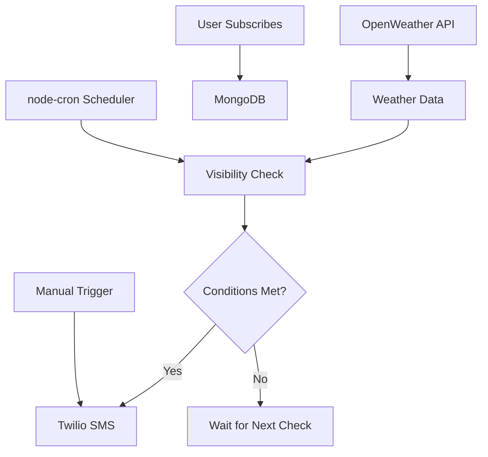

<p align="center">
  
  
  
</p>

# ☀️ Sun Visibility Alert System  

<div align="center">
  <strong>A smart weather-based SMS alert system for sunlight visibility monitoring</strong><br><br>
  
  
  
  
  
</div>

<br>

## 📖 Overview

**Sun Visibility Alert System** is a smart weather-based alert application that monitors real-time weather conditions and sends instant SMS notifications when sunlight visibility meets predefined criteria. Perfect for agriculture, outdoor activity planning, and weather-dependent decision-making.

---

## 🚀 Features

- 🌤️ **Real-time weather monitoring** using OpenWeather API
- 📩 **Instant SMS alerts** via Twilio
- ⏰ **Automated scheduling** with node-cron
- 👥 **User subscription management** with MongoDB
- 🔁 **Manual & automatic** alert triggering
- 🌐 **Responsive web interface** (HTML/CSS/JS)
- 🔐 **Secure configuration** with environment variables
- 📊 **Alert status tracking** and management

---

## 🛠️ Tech Stack

| Category | Technology |
|----------|------------|
| **Backend** | Node.js, Express.js |
| **Database** | MongoDB (Mongoose ODM) |
| **APIs** | OpenWeather API, Twilio SMS |
| **Frontend** | HTML5, CSS3, Vanilla JavaScript |
| **Scheduler** | node-cron |
| **Environment** | dotenv |

---

## 📁 Project Structure

```
KSOsunalert/
├── public/ 
│ ├── index.html
│ ├── style.css
│ └── script.js
├── models/ 
│ ├── Alert.js
│ └── Subscriber.js
├── routes/
│ ├── api.js
│ ├── sms.js
│ └── smsStatus.js
├── services/ 
│ └── alertService.js
├── utils/ 
│ └── sms.js
├── .env 
├── .env.example 
├── alerts.json 
├── db.js 
├── importAlerts.js 
├── manualAlertSMS.js 
├── server.js 
├── weather.js 
├── package.json
└── README.md
```

---

## ⚙️ How It Works



1. **Weather Monitoring**: Fetches real-time data from OpenWeather API
2. **Condition Check**: Processes sunlight visibility criteria
3. **User Management**: Stores subscriptions in MongoDB
4. **Scheduling**: node-cron runs periodic checks
5. **SMS Delivery**: Twilio sends alerts to subscribers
6. **Manual Mode**: Instant alerts when needed

---

## 🏁 Quick Start

### Prerequisites
- Node.js (v18+)
- MongoDB (local or cloud)
- [OpenWeather API key](https://openweathermap.org/api)
- [Twilio account](https://www.twilio.com/try-twilio)

### 1. Clone & Install
```bash
git clone https://github.com/your-username/sun-visibility-alert-system.git
cd sun-visibility-alert-system
npm install
```

### 2. Setup Environment
```bash
cp .env.example .env
```
Edit `.env` with your credentials:
```env
OPENWEATHER_API_KEY=your_openweather_api_key
MONGODB_URI=mongodb://localhost:27017/sunvisibility
TWILIO_ACCOUNT_SID=your_twilio_sid
TWILIO_AUTH_TOKEN=your_twilio_token
TWILIO_PHONE_NUMBER=+1234567890
PORT=3000
```

### 3. Import Alerts
```bash
npm run import-alerts
```

### 4. Start Server
```bash
# Production
npm start

# Development (with auto-reload)
npm run dev
```

### 5. Access App
Open [http://localhost:3000](http://localhost:3000)

---

## 🔧 Scripts

| Script | Description |
|--------|-------------|
| `npm start` | Start production server |
| `npm run dev` | Start with nodemon auto-reload |
| `npm run import-alerts` | Import alert configurations |
| `node manualAlertSMS.js` | Send manual SMS alert |

---

## 🧪 Testing

```bash
# Test weather API
curl http://localhost:3000/api/weather

# Test SMS endpoint
curl -X POST http://localhost:3000/api/sms/test
```
---

## 🐛 Troubleshooting

| Issue | Solution |
|-------|----------|
| `MongoDB connection failed` | Check `MONGODB_URI` and ensure MongoDB is running |
| `Weather API 401` | Verify `OPENWEATHER_API_KEY` |
| `Twilio SMS failed` | Check Twilio credentials and phone number |
| `Port already in use` | Change `PORT` in `.env` or kill process |

---

## 👨‍💻 Author

**Soni P**  
💻 Software Engineer | AI Enthusiast | Full Stack Developer  

[](https://www.linkedin.com/in/sonipandian/)
[](mailto:iamsoni.btech@gmail.com)
[](https://sonipandian.dev)

---

<div align="center">

**⭐ Star this repository if you found it helpful!**
